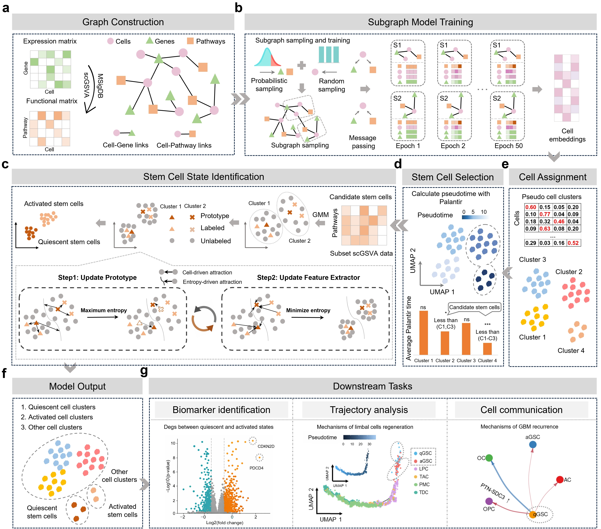

<h1 align="center">scState: Decoding stem cell state transitions through pathway-informed heterogeneous graph representations</h1>

## Description

We developed scState, a pathway-informed graph transformer designed to resolve continuous stem cell state transitions from scRNA-seq data. 

<p align="center">
  
</p>

## Installation

### System Requirements

* Python Version >=3.8.0
* Hardware Architecture: x86_64
* Operating System: GNU/Linux or Windows or MacOS

### Dependencies, scState has the following dependencies:

* anndata==0.8.0
* dill==0.3.4
* matplotlib==3.5.2
* numpy==1.24.4
* pandas==1.4.2
* scipy==1.10.1
* seaborn==0.11.2
* scikit-learn==1.1.2
* torch==2.4.1+cu118
* torch-geometric==2.6.1
* torchmetrics==0.9.3
* xlwt==1.3.0
* tqdm==4.64.0
* scanpy==1.9.1
* leidenalg==0.8.10
* ipywidgets==8.0.6
* palantir==1.0.0

### Installation Steps

The installation process involves some optional and necessary steps. Here's the detailed breakdown:

1. **Recommended Step:** Create a new environment, you should use python 3.8.

    ```bash
    conda create --name scState python=3.8
    conda activate scState
    ```

2. **Necessary Step:** You need to install either the CPU or GPU version of PyTorch as per your preference, We recommend using the GPU version, which has a faster running speed compared to the CPU version:

    - **CPU Version**
        - For Linux system (torch-1.12.0+ torch_cluster-1.6.0+ torch_scatter-2.0.9+ torch_sparse-0.6.14):
        
            ```bash
            pip install https://download.pytorch.org/whl/cpu/torch-1.12.0%2Bcpu-cp38-cp38-linux_x86_64.whl
            pip install https://data.pyg.org/whl/torch-1.12.0%2Bcpu/torch_cluster-1.6.0%2Bpt112cpu-cp38-cp38-linux_x86_64.whl
            pip install https://data.pyg.org/whl/torch-1.12.0%2Bcpu/torch_scatter-2.0.9-cp38-cp38-linux_x86_64.whl
            pip install https://data.pyg.org/whl/torch-1.12.0%2Bcpu/torch_sparse-0.6.14-cp38-cp38-linux_x86_64.whl
            ```

        - For Windows system (torch-1.12.0+ torch_cluster-1.6.0+ torch_scatter-2.0.9+ torch_sparse-0.6.14):

            ```bash
            pip install https://download.pytorch.org/whl/cpu/torch-1.12.0%2Bcpu-cp38-cp38-win_amd64.whl
            pip install https://data.pyg.org/whl/torch-1.12.0%2Bcpu/torch_scatter-2.0.9-cp38-cp38-win_amd64.whl
            pip install https://data.pyg.org/whl/torch-1.12.0%2Bcpu/torch_sparse-0.6.14-cp38-cp38-win_amd64.whl
            pip install https://data.pyg.org/whl/torch-1.12.0%2Bcpu/torch_cluster-1.6.0%2Bpt112cpu-cp38-cp38-win_amd64.whl
            ```
       - For MacOS system (torch-1.12.0+ torch_cluster-1.6.0+ torch_scatter-2.0.9+ torch_sparse-0.6.14):

            ```bash
            conda install pytorch==1.12.0
            pip install https://data.pyg.org/whl/torch-1.12.0%2Bcpu/torch_scatter-2.0.9-cp38-cp38-macosx_10_15_x86_64.whl
            pip install https://data.pyg.org/whl/torch-1.12.0%2Bcpu/torch_cluster-1.6.0-cp38-cp38-macosx_10_15_x86_64.whl
            pip install https://data.pyg.org/whl/torch-1.12.0%2Bcpu/torch_sparse-0.6.14-cp38-cp38-macosx_10_15_x86_64.whl
            ```

    - **GPU Version**
        - Please visit the official PyTorch website at [PyTorch](https://pytorch.org/) to select and download the CUDA-enabled version of PyTorch that best matches your system configuration.
        - For linux system(You need to select the version that is compatible with your system's graphics card. For example: torch-1.12.0+ torch_cluster-1.6.0+ torch_scatter-2.1.0+ torch_sparse-0.6.16):
          
             ```bash
            pip install https://download.pytorch.org/whl/cu102/torch-1.12.0%2Bcu102-cp38-cp38-linux_x86_64.whl
            pip install https://data.pyg.org/whl/torch-1.12.0%2Bcu102/torch_scatter-2.1.0%2Bpt112cu102-cp38-cp38-linux_x86_64.whl
            pip install https://data.pyg.org/whl/torch-1.12.0%2Bcu102/torch_sparse-0.6.16%2Bpt112cu102-cp38-cp38-linux_x86_64.whl
            pip install https://data.pyg.org/whl/torch-1.12.0%2Bcu102/torch_cluster-1.6.0%2Bpt112cu102-cp38-cp38-linux_x86_64.whl
             ```
        - For Windows system(You need to select the version that is compatible with your system's graphics card. For example: torch-1.12.0+ torch_cluster-1.6.0+ torch_scatter-2.1.0+ torch_sparse-0.6.16):

             ```bash
            pip install https://download.pytorch.org/whl/cu116/torch-1.12.0%2Bcu116-cp38-cp38-win_amd64.whl
            pip install https://data.pyg.org/whl/torch-1.12.0%2Bcu116/torch_scatter-2.1.0%2Bpt112cu116-cp38-cp38-win_amd64.whl
            pip install https://data.pyg.org/whl/torch-1.12.0%2Bcu116/torch_sparse-0.6.15%2Bpt112cu116-cp38-cp38-win_amd64.whl
            pip install https://data.pyg.org/whl/torch-1.12.0%2Bcu116/torch_cluster-1.6.0%2Bpt112cu116-cp38-cp38-win_amd64.whl
            ```
             
        - For MacOS system(According to the official PyTorch documentation, CUDA is not available on MacOS, please use the default package):

3. **Necessary Step:** You can directly install scState using the pip command:

    ```bash
    pip install --upgrade scState
    ```
## Code Contributor
Xue Liu carried out benchmark experiments and wrapped the code.
